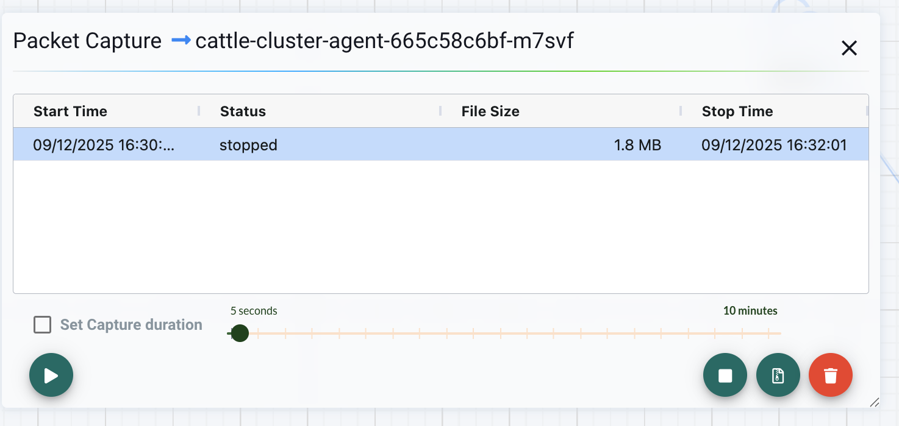

# NeuVector Packet Capture

When capturing packets for a specific Pod using NeuVector, to avoid exhausting disk space, the resulting pcap file will not exceed 10MB. However, you can obtain a larger pcap file by calling the API.

Usage:

```bash
# Replace pod_name with the actual Pod name you want to capture
# file_number defaults to 2, i.e. file_number * 2 = 4MB.  
# So if not specified, the maximum capture size is 4MB, and rolling capture will occur once it exceeds 4MB.  
# If you need a larger file, increase file_number accordingly.  
# For example, to capture about 20MB, set it to 12 (12 * 2 = 24MB).  
# When the pcap file reaches around 20MB, click Stop in the NV UI and then download the file.  
./sniffer.sh <pod_name> <file_number>

# Example: Capture a 20MB pcap file of cattle-cluster-agent-665c58c6bf-m7svf  
./sniffer.sh cattle-cluster-agent-665c58c6bf-m7svf 12
```

After running the script, you can find the corresponding Pod in the NV interface and view the packet capture generated by the script execution. Once the file size reaches the desired range, click Stop, and then download the pcap file. After downloading, please remember to delete the file to free up space.


